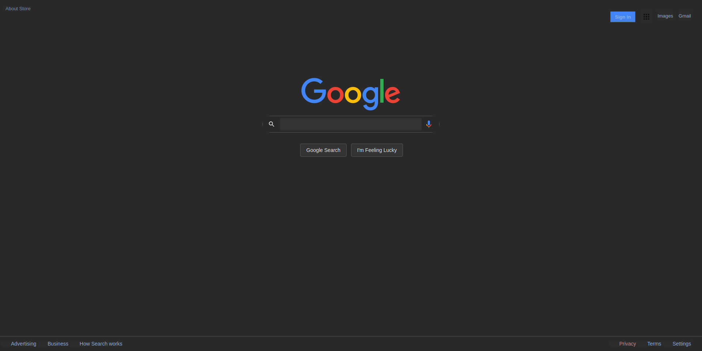

# Brief Introduction of Project:
My task was to deconstruct and rebuild the Google homepage with HTML and CSS. 
Because I love to browse the web in dark-mode, I decided to rebuild the Google homepage in dark mode!

## Demonstrated Skills:
* Familiarity with Firefox devtools
* Understanding of basic HTML webpage structure
* Able to effectively link HTML structure with CSS stylesheet
* Attention to detail!

## How was this project for me?
Overall I really enjoyed the project! Because of the repetitive nature of using devtools to reconstruct a site, I quickly became familiar with standard HTML and CSS tasks and custimization. Although I didn't enjoy how repetitive and monotonous this project was, I found much value in it. This project allowed me to apply the basics of HTML and CSS and cement my learning!
